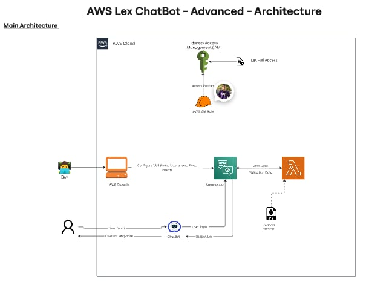

 
<b>ChatBot with Amazon Lex 🤖</b>
 

- Access AWS Console. Use of Amazon Lex. Create ChatBot with basic configurations (IAM Roles and Idle session timeout, ..).

- Amazon Lex. Specify Intents and Slots. Define Response from Fulfillments, Closing Responses, etc.

- Time to connect Lambda. Integration of our python script. Validates Data Slots and provides Flexibility with customization in the specific needs.

- We connect Lambda function wherever we want (in the Test chatbot and the specific responses that we want).

- We make IAM role, in order to integate our chatbot to Kommunicate.

- We develop a simple UI Website. We host our    static website "index.html" to S3 Bucket.

- We do configurations on the S3 Bucket for      public access. It generates a URL link.

- Kommunicate generates a js script. We        implement it in our html code.

- We now have the URL link. Our Website is       Online. So we connect.

- We now make use of the ChatBot.

- Location: Ireland (So Amazon Lex can work)!

AWS Services Used 🛠
- Amazon Lex: To build and manage the chatbot and define the conversation flow.
- Amazon Lambda: Customize our answers and Validate the Data in our Slots.
- Amazon IAM: Set our polices and integrate our ChatBot with Kommunicate
- Amazon S3 Bucket: Host our Website

Conclusion
- This chatbot project demonstrates the powerful integration capabilities of Amazon. It’s an exciting way to learn about serverless applications and real time interaction with AWS. Happy building!

 
<b>Architecture</b>
 

